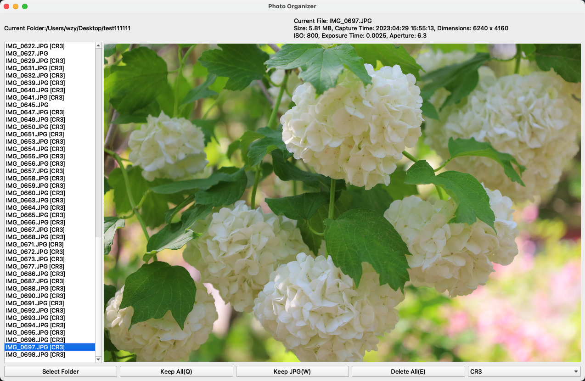

# PyPhotoOrganizer

PyPhotoOrganizer is a Python application built with PyQt5 for organizing and managing photos in a selected folder. It provides a user-friendly interface to browse through photos, display images, and perform various operations such as keeping, deleting, and filtering based on file types.

## Features

- Select a folder to organize and manage photos.
- Display photos in a list and view selected images.
- Extract and display EXIF information (capture time, dimensions, ISO, exposure time, aperture) if available.
- Keep all photos, keep only the JPEG version, or delete both the JPEG and raw versions.
- Filter photos based on file types (e.g., keep only JPEG files).
- Customizable keyboard shortcuts for quick operations.
- Supports popular raw file formats.

## Installation

1. Clone the repository:
   ```
   git clone https://github.com/xwzy/PyPhotoOrganizer.git
   ```
2. Install the dependencies:
   ```
   pip install -r requirements.txt
   ```
3. Run the application:
   ```
   python photo_organizer.py
   ```

## Usage

1. Launch the application.
2. Click the "Select Folder" button to choose the folder containing your photos.
3. The list widget displays the photos in the selected folder. Select a photo to view it in the image label.
4. Use the provided buttons or keyboard shortcuts to perform operations on the selected photo(s).
5. EXIF information, if available, will be displayed in the top labels.
6. Continue organizing and managing your photos efficiently.

## Contributing

Contributions are welcome! If you find any issues or have suggestions for improvements, please open an issue or submit a pull request.

## License

This project is licensed under the [MIT License](LICENSE).

## Acknowledgments

- [PyQt5](https://riverbankcomputing.com/software/pyqt/) - Python bindings for the Qt framework.
- [Pillow](https://python-pillow.org/) - Python Imaging Library fork for image processing.
- [ExifTags](https://pillow.readthedocs.io/en/stable/reference/ExifTags.html) - Constants for EXIF tag names.

## Screenshots


